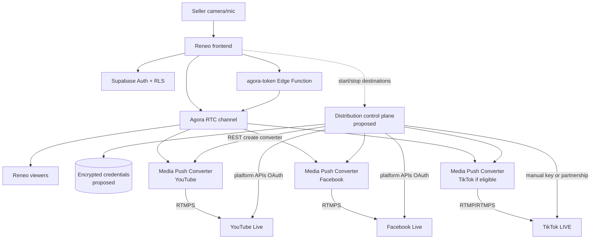
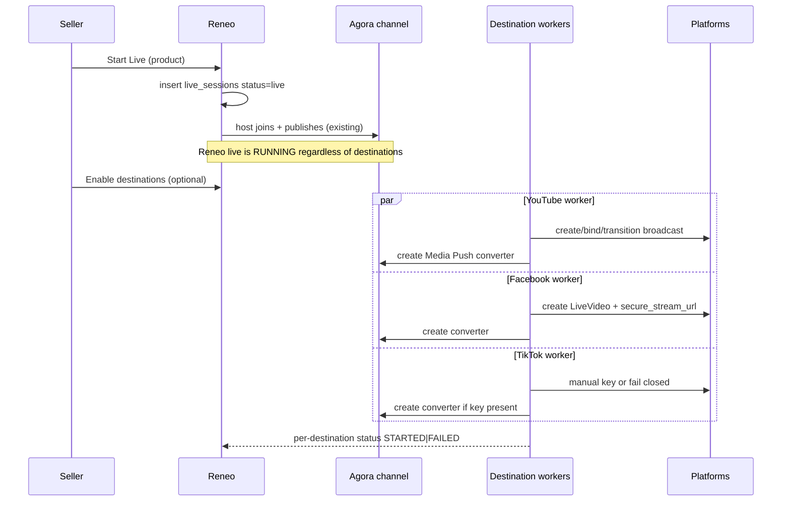
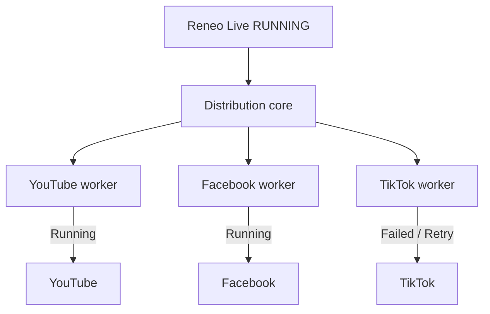

# Reneo Multistreaming Architecture

> **Document type:** Round 2 Part B — research and architecture proposal only.  
> **Status:** No multistreaming code, OAuth apps, RTMP clients, or platform integrations have been implemented.  
> **Codebase inspected:** `reneo-live` as of Part A / Phase 1 (interactive Agora live commerce).

---

## 1. Executive Summary

Reneo Live today is an Agora WebRTC live-commerce app on React + Supabase. Sellers broadcast once inside Reneo; customers watch, chat, and shop there. Part B asks how that **same** Reneo live can also reach YouTube, Facebook, and TikTok as **distribution destinations**, without turning those platforms into independent primary sessions.

**Recommended architecture (proposed):**

1. Keep Agora as the primary interactive media plane for Reneo viewers.
2. Use **Agora Media Push** (server-side RTMP/RTMPS converters) to fork channel media to each external destination independently.
3. Run a **Reneo control plane** (new Supabase Edge Functions + tables) for OAuth, broadcast lifecycle, destination status, retries, and secrets — never in the browser.
4. Ship **YouTube first**, then **Facebook/Meta** (after App Review), treat **TikTok** as **technically limited / partnership-gated** until an official third-party Live API exists.

**Hard reliability rule:**

```text
External platform failure  ≠  Reneo live failure
```

---

## 2. Current Reneo Architecture

### 2.1 What exists today (verified in codebase)

| Layer | Technology | Role |
| ----- | ---------- | ---- |
| Frontend | React + TypeScript + Vite | Seller/customer UI, Agora client |
| Auth / DB / Realtime | Supabase Auth, PostgreSQL, RLS, Realtime | Identity, lives, chat, interactions |
| Token service | Edge Function `agora-token` | Server-side RTC token minting |
| Media | Agora RTC Web SDK (`agora-rtc-sdk-ng`), `mode: 'live'`, codec `vp8` | Publish / subscribe A/V |

**There is no** Media Push, RTMP output, OAuth to social platforms, stream-key storage, or destination workers in this repository.

### 2.2 Actual media path today

```text
Seller (camera + mic)
  → Reneo React (useAgora)
  → Supabase Edge Function agora-token (JWT + live + publish checks)
  → Agora RTC channel (live_{liveIdWithoutDashes})
  → Reneo customers (audience subscribe; optional Speaker/Co-host publish)
```

Supabase holds commerce/control state (`profiles`, `products`, `live_sessions`, `messages`, `live_interactions`). Agora carries realtime A/V only.

### 2.3 Frontend live surfaces

| Route | Page | Agora role |
| ----- | ---- | ---------- |
| `/seller/live/:liveId` | `SellerLivePage` | Host publisher |
| `/lives/:liveId` | `CustomerLivePage` | Audience (or promoted publisher) |

Key modules:

- `src/hooks/useAgora.ts` — client create, join, publish, subscribe, role upgrade/downgrade
- `src/lib/agora.ts` — `fetchAgoraToken`, channel naming, UID hashing
- `src/services/live.ts` — start/end live session rows
- `src/hooks/useInteractiveLive.ts` + `src/services/interactive.ts` — Part A speak/invite flow
- `src/contexts/AuthContext.tsx` + role routes — seller vs customer UX (DB/RLS remain authoritative)

### 2.4 Backend / token flow (existing)

```text
Client → supabase.functions.invoke('agora-token', { liveId, role })
       → validate Bearer session
       → load profile + live_sessions (must be status=live)
       → if role=host: session host OR user_can_publish_on_live RPC
       → RtcTokenBuilder (PUBLISHER | SUBSCRIBER), TTL 3600s
       → { token, appId, channel, uid, role, expiresAt }
```

Secrets: `AGORA_APP_CERTIFICATE` is Edge-only (never `VITE_*`). Frontend may expose `VITE_AGORA_APP_ID` + anon Supabase key.

### 2.5 Database entities relevant to live

| Table | Purpose |
| ----- | ------- |
| `profiles` | `seller` \| `customer` |
| `products` | Featured commerce item |
| `live_sessions` | `scheduled` \| `live` \| `ended` |
| `messages` | In-Reneo chat |
| `live_interactions` | Part A speaker/co-host authority |

**Proposed (not existing):** platform connections, destination rows, encrypted tokens/stream keys, converter IDs, destination health.

### 2.6 Codec fact that drives Part B

Reneo joins with `codec: 'vp8'`. Agora Media Push docs state that in **non-transcoding** mode, RTMP forwarding requires RTMP-standard codecs such as **H.264/H.265**; **if the source is VP8, use transcoding mode**. Therefore Reneo → social RTMP **requires transcoding** with the current client codec choice (unless the Web client is later changed to H.264 *and* single-host passthrough is validated — still proposed, not current).

---

## 3. Problem Definition

Sellers want:

```text
ONE Reneo Live
       │
       ├────────→ Reneo viewers (interactive commerce)
       ├────────→ YouTube
       ├────────→ Facebook
       └────────→ TikTok
```

Constraints:

- Start once from Reneo.
- External platforms are **mirrors / acquisition channels**, not separate primary controls.
- Reneo remains product, cart, orders, payments, analytics, and interactive co-host home.
- One destination failing must not stop Reneo or other destinations.

---

## 4. Goals and Non-Goals

### Goals

- Architecture for forking one Agora channel to N RTMP/RTMPS destinations.
- Control plane for OAuth, broadcast create/bind/start/stop, destination status.
- Failure isolation, retries, credential security model.
- Platform feasibility with official sources and honest unknowns.
- Cost and latency order-of-magnitude analysis.

### Non-Goals (this document / Part B)

- Implementing Media Push, OAuth, or workers.
- Changing Phase 1 interactive live behavior.
- Building checkout/payments.
- Guaranteeing TikTok API parity with YouTube/Facebook.

---

## 5. Proposed Architecture

### Existing vs proposed

| Concern | Existing | Proposed |
| ------- | -------- | -------- |
| Reneo interactive live | Agora WebRTC | Unchanged primary path |
| Social distribution | — | Agora Media Push converters (1 per destination) |
| Platform OAuth / APIs | — | Reneo Edge Functions + encrypted credential store |
| Destination status | — | `live_destinations` + Realtime UI on seller live |
| Secrets in browser | Agora cert already blocked | Platform tokens / stream keys also never leave backend |

### Conceptual stack

```text
Seller starts Reneo live (existing)
        │
        ▼
Agora channel (existing primary)
        │
        ├── Reneo viewers (WebRTC) ──────────────────────────────► commerce UX
        │
        └── Agora Media Push Converter(s) ──RTMP/RTMPS──► YouTube / Facebook / …
                    ▲
                    │ control: create/update/delete converter
                    │
            Reneo Distribution Control Plane (proposed)
                    │
                    ├── OAuth + platform Live APIs
                    └── Destination workers / state machine
```

**Why Agora Media Push (not browser RTMP):** The seller’s browser already publishes WebRTC to Agora. Pushing RTMP from the browser would add uplink load, reliability risk, and cannot safely hold stream keys. Media Push subscribes server-side to the channel and pushes out — Reneo viewers stay on the low-latency WebRTC path.

---

## 6. High-Level Architecture Diagram



---

## 7. Control Plane

**Proposed.** Reneo owns:

| Responsibility | Notes |
| -------------- | ----- |
| Seller auth | Existing Supabase Auth |
| Connect platform accounts | OAuth redirect → store refresh/access tokens encrypted |
| Create/manage external broadcasts | YouTube Live Streaming API; Meta Live Video API where approved |
| Destination config | Which platforms enabled for this live |
| Start/stop destinations | After Reneo `live_sessions.status = live` |
| Status / errors / reconnect | Per-destination state machine |
| Metadata | Titles, descriptions with Reneo deep links where allowed |

Suggested tables (**proposed, not in migrations**):

- `platform_connections` — seller_id, platform, encrypted tokens, scopes, expires_at, revoked
- `live_destinations` — live_id, platform, status, external_broadcast_id, converter_id, last_error, retry_count
- Secrets preferably in a vault (Supabase Vault / KMS) rather than plaintext columns

Control plane must remain **asynchronous** relative to Agora join: Reneo live starts even if all destinations fail.

---

## 8. Media Plane

**Proposed.** Media plane owns:

| Responsibility | Notes |
| -------------- | ----- |
| Receive Reneo stream | Agora Media Push joins channel as subscriber |
| Transcode | Required for VP8 → H.264 and multi-publisher layouts |
| Push to platforms | One converter (or worker) per destination URL |
| Independent outputs | Destroying one converter must not affect others |

Protocols by stage:

| Stage | Protocol | Why |
| ----- | -------- | --- |
| Seller → Agora | WebRTC | Existing interactive low-latency path |
| Reneo viewers ← Agora | WebRTC | Not replaced by HLS/RTMP |
| Agora → CDN/social | RTMP / RTMPS | What YouTube/Facebook ingest expect |
| Platform → their viewers | Platform CDN (HLS etc.) | Outside Reneo control |
| HLS as Reneo primary | Not used | Higher latency; wrong for co-host interactivity |

---

## 9. Media Ingestion

### How the distribution layer receives the Reneo stream

**Proposed ingestion:** Agora Media Push Converter created via RESTful API:

- `POST https://api.agora.io/{region}/v1/projects/{appId}/rtmp-converters`
- Bind `rtcChannel` = existing `live_{liveIdWithoutDashes}`
- Set `rtmpUrl` to platform ingest (RTMP or RTMPS URL + stream key as required by platform)

**Verified (Agora):** Media Push streams Agora channel A/V to CDNs / RTMP-based platforms; converters are created/managed via REST; RTMP and RTMPS are supported at the product level.

**Not existing in Reneo:** no converter create/delete calls today.

### Alternative ingestion (rejected as primary)

| Alternative | Why not primary |
| ----------- | --------------- |
| Browser dual-publish WebRTC + RTMP | Stream keys in client; double uplink; poor isolation |
| Cloud FFmpeg bot joining as audience | Possible but ops-heavy vs Agora-native push |
| Managed restream SaaS only | Faster MVP, weaker Reneo control / vendor lock |

---

## 10. Transcoding and Processing

| Question | Answer for Reneo |
| -------- | ---------------- |
| Always required? | **Yes with current VP8 client** (Agora: VP8 sources need transcoding mode for RTMP). |
| Multi Speakers/Co-hosts (Part A)? | **Yes** — mix into one canvas for social audiences who cannot subscribe to multiple WebRTC pubs. |
| Single host, if codec were H.264? | Agora allows non-transcoding passthrough; still **not current Reneo config**. |
| Resize / bitrate | Recommended HD (≤1280×720) output for cost + platform ingest norms. |
| Audio | Transcode to AAC/HE-AAC as configured in Media Push `audioOptions`. |

**Estimate:** Social viewers see a **composited** stage (host + active co-hosts), not the full interactive WebRTC grid UX.

---

## 11. Restreaming / Distribution

### Per-destination workers (logical)

Each destination is an independent unit:

```text
DestinationWorker(platform):
  1. Ensure platform broadcast + ingest credentials
  2. Create Agora converter → that ingest URL only
  3. Monitor converter + platform health
  4. Retry / backoff on failure
  5. On stop: delete converter + end platform broadcast
```

Isolation: YouTube converter failure → Facebook converter untouched → Agora channel untouched.

### Platform media reach

| Platform | Media path |
| -------- | ---------- |
| YouTube | Control API creates `liveBroadcast` + `liveStream`, bind, transition; media via RTMPS ingest |
| Facebook | Live Video API returns `secure_stream_url`; encoder pushes RTMPS |
| TikTok | **No verified public third-party Live create/push API** on TikTok for Developers; creator RTMP keys may exist as a **creator capability**, not a SaaS API |

---

## 12. Platform Connections and OAuth

### YouTube (verified from Google docs)

```text
Seller → Connect YouTube → Google OAuth
  scopes typically: https://www.googleapis.com/auth/youtube
                 or https://www.googleapis.com/auth/youtube.force-ssl
  → access token + refresh token (server-side web app flow)
  → Reneo stores encrypted refresh token
```

- Live Streaming API uses OAuth 2.0; **service accounts are not supported**.
- Channel must be enabled for live streaming or API returns `liveStreamingNotEnabled` / insufficient permissions.
- Creator eligibility (Help Center): verify channel; no live restrictions in past 90 days; age rules apply.

**Token handling (proposed):** refresh on backend; never send refresh tokens to frontend; revoke on disconnect.

### Facebook / Meta (verified from Meta docs)

```text
Seller → Facebook Login → grant permissions → Reneo stores tokens
```

Documented permissions:

| Target | Permissions |
| ------ | ----------- |
| User profile live | `publish_video` |
| Page live | `pages_manage_posts`, `pages_read_engagement` |

**App Review required** for Live Video API feature + those permissions for non-dev users.

Eligibility (Meta Help / API errors): account ≥ 60 days old; Page or professional mode profile ≥ 100 followers (as of June 10, 2024 requirements documented by Meta).

Encoder must produce **live RTMPS** to Facebook.

### TikTok

**Official TikTok for Developers** publicly documents Login Kit and **Content Posting API** (upload/direct post of VOD/photos with scopes such as `video.publish` / `video.upload`).  

**Could not verify** a public, documented third-party API to:

- create a TikTok LIVE,
- mint RTMP credentials programmatically,
- or start/stop LIVE on behalf of a seller via OAuth.

Creator-facing RTMP / LIVE Studio / stream keys appear in third-party encoder guides and TikTok creator tooling, but that is **creator capability**, not confirmed **third-party API capability**.

**Proposed interim:** optional **manual RTMP destination** (seller pastes server URL + stream key obtained from TikTok UI) with clear UX that Reneo cannot auto-create TikTok lives via official API until TikTok documents one.

---

## 13. Stream Keys and Credential Security

**Proposed security model (nothing of this exists in repo today):**

```text
Frontend
  ❌ never receives long-lived platform secrets / stream keys / refresh tokens

Backend (Edge Functions / workers)
  ↓
Encrypted at rest (Vault / KMS / column encryption)
  ↓
Distribution worker fetches short-lived use of ingest URL
  ↓
Agora Media Push converter (rtmpUrl assembled server-side)
```

| Secret | Storage | Browser |
| ------ | ------- | ------- |
| OAuth access/refresh | Encrypted server store | No |
| RTMP URL + stream key | Encrypted; prefer ephemeral per live | No |
| Platform broadcast IDs | DB OK (not secret-level) | Yes (status UI) |
| Agora App Certificate | Existing Edge secrets | No |

Practices:

- Encryption at rest; least-privilege DB RLS (host-only rows).
- Token rotation via refresh; revoke on seller disconnect / platform webhook if available.
- Redact tokens/keys from logs.
- Rotate stream keys when platforms issue session-scoped keys (especially TikTok manual flow — treat as short-lived).

---

## 14. Start / Stop Synchronization

### Start



Partial success is normal:

```text
YouTube  → STARTED
Facebook → STARTED
TikTok   → FAILED
Reneo    → RUNNING
```

### Stop

```text
Seller ends Reneo live
  → live_sessions.status = ended (existing)
  → for each destination independently:
       delete Agora converter
       transition/end platform broadcast (best effort)
  → destination failures logged; do not block ending Reneo
```

Synchronization = **Reneo session is parent**; destinations are **children that must not block parent**.

---

## 15. Failure Isolation and Reconnection



### Isolation rules

- No shared mutable “global stream lock” across destinations.
- One converter ID per destination row.
- Worker crashes do not call Agora `leave` for the seller.
- UI shows per-destination badges (Running / Reconnecting / Failed).

### Retry strategy (**recommendation / estimate**)

| Phase | Behavior |
| ----- | -------- |
| Transient RTMP disconnect | Exponential backoff (e.g. 2s → 4s → 8s … cap ~60s) |
| Recreate converter | After N failed health checks |
| Platform API 4xx eligibility | Stop retry; surface seller action |
| Max retries / time budget | Mark `FAILED`; keep Reneo live |
| Seller manual retry | Button resets that destination only |

### Seller visibility

Proposed Realtime updates on `live_destinations` so `/seller/live/:id` shows platform health without affecting viewer pages.

---

## 16. Platform-by-Platform Feasibility

Status labels used **exactly** as required:

`Available now` | `Requires approval or partnership` | `Technically limited` | `Not available`

| Platform | Status | Streaming / Ingestion | API | OAuth | Approval | Eligibility | Third-party restreaming | Official source |
| -------- | ------ | --------------------- | --- | ----- | -------- | ----------- | ----------------------- | --------------- |
| YouTube | **Available now** (channel must be live-enabled) | RTMP / RTMPS / HLS / DASH ingest documented | Live Streaming API (`liveBroadcast`, `liveStream`, bind, transition) | OAuth 2.0; scopes `youtube` / `youtube.force-ssl` | Google Cloud project + OAuth client; API enablement | Verified channel; no recent live restriction; API error if live not enabled | Encoder/API ingest is the supported model; terms still apply | [Live Streaming API overview](https://developers.google.com/youtube/v3/live/getting-started), [RTMPS](https://developers.google.com/youtube/v3/live/guides/rtmps-ingestion), [Help: get started](https://support.google.com/youtube/answer/2474026) |
| Facebook / Meta | **Requires approval or partnership** (App Review) | RTMPS via `secure_stream_url` | Live Video API | Facebook Login + permissions | App Review for Live Video API + perms | Account ≥60 days; ≥100 followers (Page/pro mode) | App must produce RTMPS; restreamers that use official Live Video API are in scope of same review | [Live Video API](https://developers.facebook.com/docs/live-video-api/), [Broadcasting](https://developers.facebook.com/docs/live-video-api/guides/streaming/) |
| TikTok | **Technically limited** (and often **Requires approval or partnership** for any special Live access) | Creator RTMP keys exist for some accounts via TikTok tooling — not verified as open developer API | Public docs: Content Posting (VOD), not Live create/push | Login Kit for auth; Live scopes **not verified** | Content Posting needs scope approval; Live API partnership **could not be verified** as public | LIVE access ≠ RTMP access (creator reports; official universal rules incomplete in retrieved docs) | Third-party restream often uses manual keys or private partnerships — **not** a documented open API | [TikTok Content Posting API](https://developers.tiktok.com/products/content-posting-api); no Live RTMP API found on developers.tiktok.com |

### YouTube

**API vs media (do not confuse):**

| Plane | Mechanism |
| ----- | --------- |
| Control | `liveBroadcasts.insert`, `liveStreams.insert`, `bind`, `transition` (testing → live → complete) |
| Media | Encoder pushes to `cdn.ingestionInfo.rtmpsIngestionAddress` (or RTMP address) |

Quotas: YouTube Data API projects have a default daily quota unit pool (commonly cited as 10,000 units/day in Google quota docs). Exact per-method costs should be taken from current Google Cloud quota pages at implementation time. Live-specific channel limits (Help Center): e.g. limits on active streams per channel/key — verify before scale.

### Facebook / Meta

- Create LiveVideo → receive `secure_stream_url` → push RTMPS → go live when bytes arrive.
- Comments/reactions APIs exist for interaction (see §21).
- Lead time for App Review: Meta documents review requirement; **exact calendar SLA could not be verified** as a fixed number.

### TikTok

Distinguish clearly:

```text
Creator capability: go LIVE in app / LIVE Studio / sometimes RTMP key
Third-party API capability: NOT verified in public TikTok for Developers Live docs
```

### Other relevant platforms

| Platform | Note |
| -------- | ---- |
| Twitch | Common RTMP ingest; not in brief core three but Media Push-compatible pattern |
| Instagram Live | Could not verify a public third-party RTMP Live API equivalent to Facebook Pages Live Video API in this research pass — treat as **Not available** / **Requires approval** until Meta docs confirm for Reneo’s use case |

---

## 17. Cost Analysis

### Verified Agora Media Push transcoding prices

Source: [Agora Media Push pricing](https://docs.agora.io/en/realtime-media/media-push/reference/pricing)

| Scenario | Audio | H.264 HD (≤1280×720) | H.264 Full HD |
| -------- | ----- | -------------------- | ------------- |
| Multi-host (or resolution change) | $3.99 / 1,000 min | $7.99 / 1,000 min | $15.99 / 1,000 min |
| Single-host, properties unchanged | $1.99 / 1,000 min | $1.99 / 1,000 min | — |

Notes from Agora:

- Video transcoding fee applies when A/V transcoded together (video rate charged).
- Subscription minutes of the Media Push subscriber also bill like RTC audience minutes (see Agora RTC pricing; free-minute policy may apply to subscription but **not** to transcoding).
- **Assumption for Reneo Part A:** Speakers/Co-hosts ⇒ treat as **multi-host** pricing when they are publishing.

### Order-of-magnitude per destination / hour

**Assumptions (labeled):**

- One HD H.264 output per destination, multi-host rate $7.99 / 1,000 min ⇒ **≈ $0.48 / hour / destination** transcoding only (**calculation** from verified unit price).
- RTC subscription cost for the converter’s subscribe leg: **estimate** small relative to interactive audience minutes already incurred; exact RTC SKU depends on resolution — see Agora RTC pricing at bill time.
- YouTube / Facebook / TikTok: **no per-hour ingest fee** found in official Live docs researched (**verified absence of a published “$X/hour ingest”** for normal creator API ingest); monetization/ads are separate.

| Destination | Processing (transcode) | Bandwidth / egress | Platform cost | Estimated total/hour |
| ----------- | ---------------------: | -----------------: | ------------: | -------------------: |
| YouTube | ~$0.48 HD multi-host (**calc** from Agora) | Included in Agora push path (**assumption**: no separate Reneo CDN egress) | $0 ingest (**verified** no public ingest fee) | **~$0.50–1.50** (**estimate** incl. RTC subscribe share) |
| Facebook | ~$0.48 | same | $0 ingest | **~$0.50–1.50** (**estimate**) |
| TikTok | ~$0.48 if key available | same | $0 ingest if using creator RTMP | **~$0.50–1.50** (**estimate**) + partnership unknown |

**Cost scales with:** number of destinations (N converters ≈ N × transcode), resolution (HD vs Full HD), concurrent lives, and whether co-hosts force multi-host rates.

**Rejected cost path:** AWS Elemental MediaLive + custom join bot — typically **higher $/hr** for HD in/out stacks (region-specific; see [MediaLive pricing](https://aws.amazon.com/medialive/pricing/)); more engineering. Managed restream SaaS: subscription tiers vary; treat as **estimate only** without pinning a vendor price here unless quoting their public plan page at purchase time.

---

## 18. Latency Analysis

```text
Seller capture
  → WebRTC encode
  → Agora SDRTN (Reneo viewers: low latency)
  → Media Push subscribe + transcode
  → RTMPS to platform
  → Platform packaging / CDN
  → Platform viewer
```

| Segment | Relative latency | Confidence |
| ------- | ---------------- | ---------- |
| Reneo WebRTC viewers | Lowest (interactive) | Architecture fact |
| + Media Push transcode | Adds processing delay | **Estimate:** seconds-scale |
| + Platform ingest + CDN | Dominant for social viewers | **Estimate:** often multi-second to tens of seconds depending on platform latency mode |
| Passthrough vs transcode | Passthrough lower if codec allows; Reneo VP8 ⇒ transcode | Agora guidance |
| Ultra-low-latency YouTube modes | Documented as supported for RTMP/RTMPS ingest classes | See YouTube ingestion comparison; exact ms **not claimed** |

Do **not** expect social viewers to participate as Speakers; chat delay will feel higher than Reneo chat.

---

## 19. Keeping Reneo at the Centre

Social platforms are **audience + acquisition channels**.

Reneo remains:

```text
Products · Store · Cart · Orders · Customers · Payments · Analytics · Live commerce · Interactive co-hosts
```

Architecture must not collapse to “Reneo is only a restreamer UI.” Distribution is a **sidecar** on the Agora channel; commerce and interaction stay on Reneo URLs (`/lives/:id`).

Acquisition pattern:

1. Discover on YouTube/Facebook/TikTok.
2. Click/profile/link → Reneo live or product page.
3. Purchase / speak request only inside Reneo (where auth + RLS exist).

---

## 20. Redirecting Viewers Back to Reneo

| Platform | Mechanism to bring viewers to Reneo | Restrictions | Source |
| -------- | ----------------------------------- | ------------ | ------ |
| YouTube | Description URLs; channel profile links; pinned comments; Live chat links on **horizontal** streams | Advanced features may be required for clickable external links; **vertical live feed**: links in chat/channel description **non-clickable** on mobile vertical feed; Shorts-style restrictions; External links policy | [Sharing links](https://support.google.com/youtube/answer/13748639), [Live streaming help](https://support.google.com/youtube/answer/2474026) |
| Facebook | Live `description` field via API; Page about/website; comments | Reach/policy for external links evolving; Community Standards / Live policies apply. Exact “featured link during Live” product details should be re-checked in Meta Business Help at build time | [Page Live Videos](https://developers.facebook.com/docs/graph-api/reference/page/live_videos/), Meta Live policies |
| TikTok | Profile **Website** field (official help article exists: “Adding a website link to your profile”); verbal “link in bio” | Clickable caption/LIVE description links **could not be verified** as generally available; eligibility for website field **could not be fully extracted** from support page content in this session — confirm on TikTok Support before promising sellers | [TikTok Support – website link](https://support.tiktok.com/en/getting-started/setting-up-your-profile/adding-a-website-link-to-your-profile) |

**Recommendation:** Always put a short Reneo URL in platform descriptions where clickable; use trackable redirects (`reneo.app/r/{liveId}?src=youtube`).

---

## 21. Future Centralization

| Capability | YouTube | Facebook | TikTok | Reneo can centralize today? | Dependency |
| ---------- | ------- | -------- | ------ | --------------------------- | ---------- |
| Viewer count | Live Streaming / analytics APIs exist in ecosystem; exact live concurrent endpoint usage needs implementation review | Live Video object fields / insights — verify per Graph version | Not verified via public Live API | **Partially** for YT/FB after OAuth | Platform APIs + polling |
| Comments | `liveChatMessages` API documented | `/live-video-id/comments` + SSE live_comments | Not verified | **Partially** (YT, FB) | OAuth + App Review (FB) |
| Reactions | Super Chat / likes differ; not 1:1 with FB | `/reactions` + live_reactions SSE | Not verified | **Partially** (FB stronger) | Graph permissions |
| Live statistics | YouTube Analytics (separate products/scopes) | Page insights / video insights | Not verified | **Not available** as unified today | Extra APIs |
| Unified chat | Possible ingest of YT live chat + FB comments into Reneo UI | Same | Unlikely without API | **Not available** as production feature today; **feasible later** for YT/FB | Moderation, rate limits, ToS |

Classification summary: YouTube/Facebook engagement centralization is **partially available** with APIs; TikTok is **depends on future API support**; full unified chat is a **future** project, not Part B MVP.

---

## 22. Technology Options Considered

### Option A — Managed restreaming service

**Pros:** Fast; built-in destinations; less ops.  
**Cons:** Vendor lock; cost; less control over layout/composites; may not map cleanly to Agora WebRTC source; Reneo becomes thin client.

### Option B — Self-hosted FFmpeg / media server

**Pros:** Full control; potentially lower unit cost at huge scale.  
**Cons:** Must join Agora (or receive a relay), transcode, push N× RTMPS, HA, monitoring — high engineering and reliability burden.

### Option C — Cloud media services (e.g. AWS MediaLive)

**Pros:** Managed transcode/packaging.  
**Cons:** Still need Agora → cloud ingest bridge; typically higher cost/complexity than Agora Media Push when Agora is already the SFU.

### Option D — Agora Media Push (recommended)

**Pros:** Native to existing channel; REST converters; RTMP/RTMPS; transcoding/layout for multi-host; per-URL isolation; aligns with current stack.  
**Cons:** Agora cost; feature enablement in Console (cannot disable once enabled per Agora docs); VP8 forces transcode; TikTok still blocked by platform API gaps.

---

## 23. Recommended Architecture

```text
Recommended architecture:
  Reneo (Supabase control plane)
    + Agora RTC (primary interactive media)
    + Agora Media Push (one converter per social destination)
    + Platform OAuth/Live APIs for YouTube then Facebook
    + Manual/partner TikTok until official Live API exists
```

**Why:**

1. Matches the **existing** Agora channel without dual-encoding from the seller browser.
2. Gives **per-destination isolation** (separate converters).
3. Official **YouTube** and **Meta** ingest models are RTMP/RTMPS — Media Push outputs that.
4. Keeps commerce/interaction **inside Reneo**; social is acquisition.
5. Faster and more reliable than self-hosted FFmpeg for a small team; more controllable than a black-box restream SaaS sitting in front of Reneo.

### Build order

| First | Later |
| ----- | ----- |
| YouTube OAuth + broadcast lifecycle + Media Push converter | Facebook App Review + Page lives |
| Destination status UI + failure isolation | Engagement ingest (chat mirror) |
| Encrypted credential store | Manual TikTok RTMP destination |
| | TikTok official Live API if/when published |

### What requires platform approval

- Meta App Review (Live Video API + permissions).
- Google OAuth verification if using sensitive scopes in production.
- Any TikTok Live partnership (**if** offered — not verified as self-serve).

### What stays async / independently scalable / isolated

- Destination workers and converters (scale horizontally per live × platform).
- OAuth refresh jobs.
- Engagement polling (future).

### What remains inside Reneo

- Auth, products, cart, chat, Part A interactions, live session authority, seller dashboard.

---

## 24. Limitations and Unknowns

| Item | Classification |
| ---- | -------------- |
| Multistreaming not implemented | Fact |
| TikTok public Live API | **Could not verify** from current official developer docs |
| Exact App Review calendar time (Meta) | **Could not verify** fixed SLA |
| Exact social viewer latency ms | **Estimate only** |
| Agora Media Push + every platform ToS nuance for automated restream | Re-read platform Terms before production; do not assume blanket permission |
| Whether sellers must disclose simultaneous streams | Policy/ToS review at launch |
| Instagram Live third-party RTMP | **Could not verify** equivalent public API |
| TikTok bio link exact eligibility thresholds | Confirm on live TikTok Support article at implementation time |

---

## 25. Conclusion

Part A already delivers interactive live commerce on Agora + Supabase. Part B should **fork** that Agora media via **Agora Media Push** to social RTMP/RTMPS destinations under a Reneo control plane, with **strict failure isolation**. YouTube is the clear first destination; Facebook follows after Meta review; TikTok remains limited until TikTok publishes a real third-party Live API (manual keys only as a stopgap). Reneo stays the commerce and interaction centre; social platforms remain acquisition surfaces.

---

## 26. Sources

### Reneo codebase (inspected)

- `README.md`
- `src/hooks/useAgora.ts`, `src/lib/agora.ts`
- `supabase/functions/agora-token/index.ts`
- `src/services/live.ts`, `src/pages/SellerLive.tsx`, `src/App.tsx`
- Migrations under `supabase/migrations/`

### Agora

- [Enable Media Push](https://docs.agora.io/en/media-push/get-started/enable-media-push)
- [Media Push RESTful API](https://docs.agora.io/en/media-push/develop/restful-api)
- [Media Push overview](https://docs.agora.io/en/realtime-media/media-push)
- [Media Push pricing](https://docs.agora.io/en/realtime-media/media-push/reference/pricing)
- [Media Push billing / free minutes](https://docs.agora.io/en/media-push/reference/billing-policies)

### YouTube / Google

- [YouTube Live Streaming API overview](https://developers.google.com/youtube/v3/live/getting-started)
- [OAuth authentication](https://developers.google.com/youtube/v3/live/authentication)
- [LiveStreams resource / RTMPS fields](https://developers.google.com/youtube/v3/live/docs/liveStreams)
- [RTMPS ingestion guide](https://developers.google.com/youtube/v3/live/guides/rtmps-ingestion)
- [Ingestion protocol comparison](https://developers.google.com/youtube/v3/live/guides/ingestion-protocol-comparison)
- [liveChatMessages](https://developers.google.com/youtube/v3/live/docs/liveChatMessages)
- [Get started with live streaming (Help)](https://support.google.com/youtube/answer/2474026)
- [Sharing links with your audiences](https://support.google.com/youtube/answer/13748639)

### Meta / Facebook

- [Live Video API](https://developers.facebook.com/docs/live-video-api/)
- [Broadcasting guide](https://developers.facebook.com/docs/live-video-api/guides/streaming/)
- [Getting started](https://developers.facebook.com/docs/live-video-api/getting-started/)
- [Interact with viewers](https://developers.facebook.com/docs/live-video-api/interact-with-viewers/)
- [Live Video comments](https://developers.facebook.com/docs/graph-api/reference/live-video/comments/)
- [Live Video reactions](https://developers.facebook.com/docs/graph-api/reference/live-video/reactions/)

### TikTok

- [Content Posting API product](https://developers.tiktok.com/products/content-posting-api)
- [Content Posting get started](https://developers.tiktok.com/doc/content-posting-api-get-started)
- [Login Kit (Desktop)](https://developers.tiktok.com/doc/login-kit-desktop/)
- [Adding a website link to your profile (Support)](https://support.tiktok.com/en/getting-started/setting-up-your-profile/adding-a-website-link-to-your-profile)

### Cloud cost reference

- [AWS Elemental MediaLive pricing](https://aws.amazon.com/medialive/pricing/)

---

*End of Part B architecture document. No application code was modified to implement multistreaming.*
